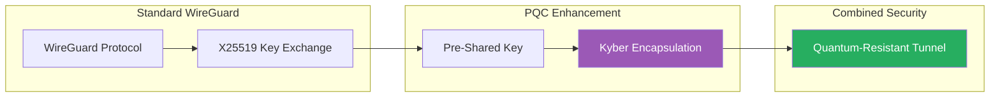

# Abejar Post-Quantum Cryptography VPN Router

<p align="center">
  <strong>WireGuard + Pre-Shared Key Edition</strong>
</p>

<p align="center">
  
  
  
</p>

---

## Overview

**Abejar PQC VPN Router (WireGuard + PSK Edition)** implements post-quantum security using standard WireGuard with enhanced pre-shared key (PSK) protection combined with Kyber key encapsulation.

This is the **most production-ready** variant, using battle-tested WireGuard with an additional layer of quantum-resistant security.

### How It Works



### Key Features

- **Standard WireGuard** - No modified protocol, maximum compatibility
- **Kyber-Encapsulated PSK** - Pre-shared keys protected by Kyber-1024
- **Automatic Key Rotation** - PSK refreshed periodically with new Kyber encapsulation
- **Production Ready** - Stable, tested, reliable

## Quick Start

```bash
docker pull ghcr.io/vinzabe/abejar-pqc-wireguard-psk:latest
git clone https://github.com/vinzabe/abejar-pqc-vpn-wireguard-psk.git
cd abejar-pqc-vpn-wireguard-psk
./scripts/setup.sh
docker compose up -d
```

## Security Model

| Layer | Technology | Protection |
|-------|------------|------------|
| Transport | WireGuard | Modern VPN protocol |
| Key Exchange | X25519 | Classical security |
| Additional Layer | PSK + Kyber | Quantum resistance |
| Encryption | ChaCha20-Poly1305 | Symmetric security |

## Contact

For full source code and enterprise licensing:

**Email:** grant@abejar.net

---

Copyright 2024 Abejar. All rights reserved.
