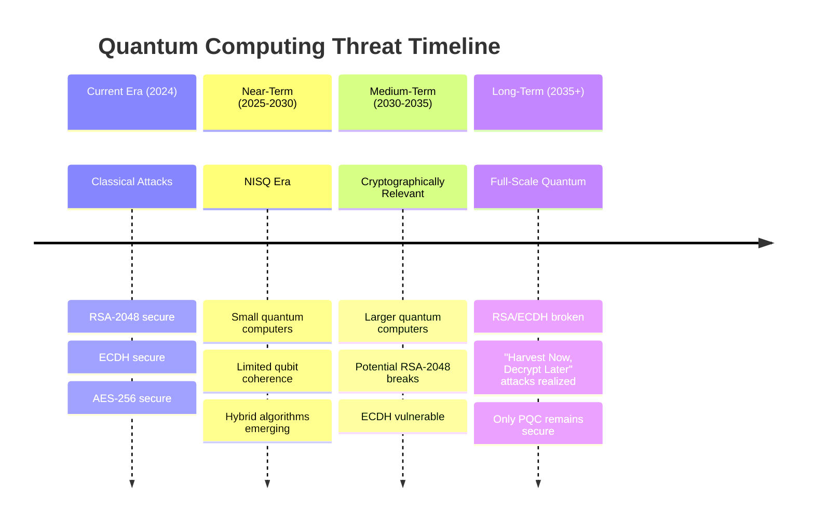
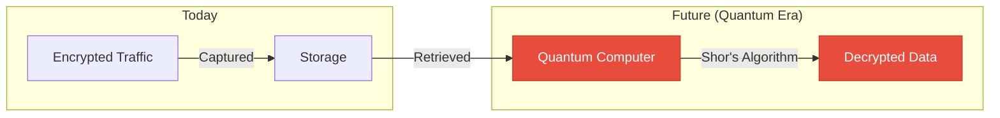
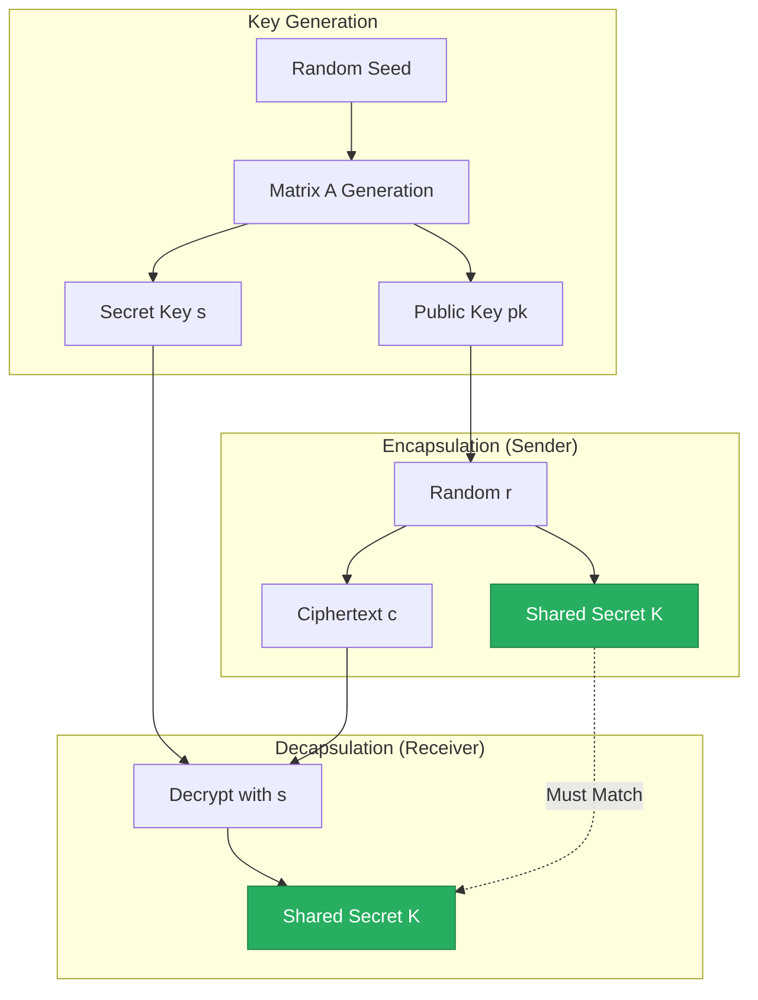
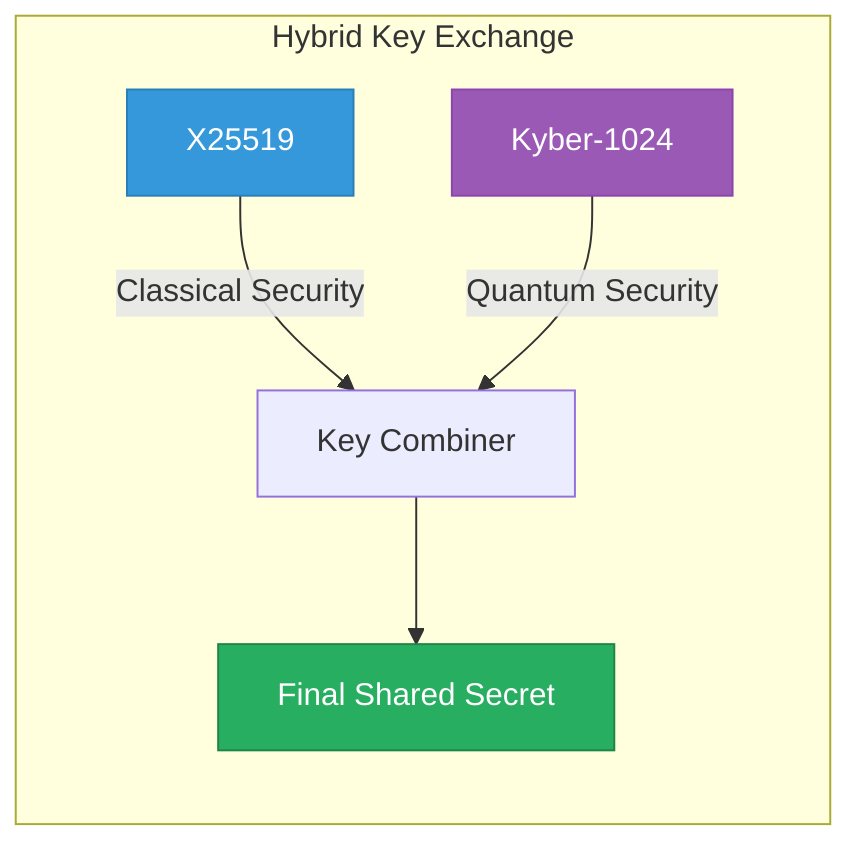
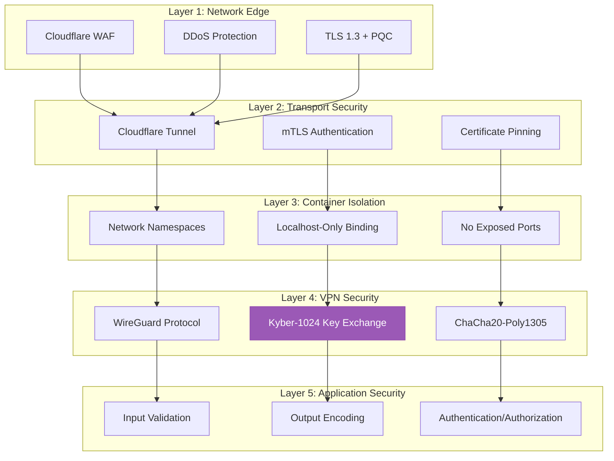
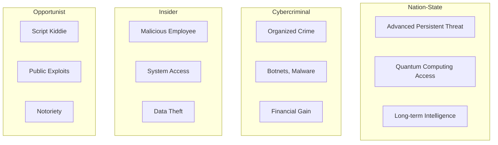

# Security Policy & Post-Quantum Cryptography

<p align="center">
  
  
  
</p>

---

## Table of Contents

- [Quantum Threat Landscape](#quantum-threat-landscape)
- [Post-Quantum Cryptography Implementation](#post-quantum-cryptography-implementation)
- [Security Architecture](#security-architecture)
- [Threat Model](#threat-model)
- [Cryptographic Specifications](#cryptographic-specifications)
- [Security Best Practices](#security-best-practices)
- [Incident Response](#incident-response)
- [Reporting Vulnerabilities](#reporting-vulnerabilities)

---

## Quantum Threat Landscape

### The Quantum Computing Threat

Quantum computers pose an existential threat to current cryptographic systems:



### Vulnerable Algorithms

| Algorithm | Type | Quantum Attack | Time to Break |
|-----------|------|----------------|---------------|
| RSA-2048 | Asymmetric | Shor's Algorithm | Hours |
| RSA-4096 | Asymmetric | Shor's Algorithm | Days |
| ECDH P-256 | Key Exchange | Shor's Algorithm | Hours |
| ECDSA P-256 | Signature | Shor's Algorithm | Hours |
| AES-128 | Symmetric | Grover's Algorithm | Reduced to 64-bit |
| AES-256 | Symmetric | Grover's Algorithm | Reduced to 128-bit |

### "Harvest Now, Decrypt Later" (HNDL)

Adversaries may be capturing encrypted traffic today with the intention of decrypting it once quantum computers become available:



**This is why implementing PQC NOW is critical** - even if quantum computers are years away.

---

## Post-Quantum Cryptography Implementation

### Kyber-1024

This implementation uses **Kyber-1024**, the NIST-standardized post-quantum key encapsulation mechanism:



### Kyber Specifications

| Parameter | Kyber-512 | Kyber-768 | **Kyber-1024** |
|-----------|-----------|-----------|----------------|
| Security Level | NIST 1 | NIST 3 | **NIST 5** |
| Classical Security | 128-bit | 192-bit | **256-bit** |
| Public Key Size | 800 bytes | 1184 bytes | **1568 bytes** |
| Ciphertext Size | 768 bytes | 1088 bytes | **1568 bytes** |
| Shared Secret | 32 bytes | 32 bytes | **32 bytes** |
| Encaps Time | ~0.03 ms | ~0.04 ms | **~0.05 ms** |
| Decaps Time | ~0.03 ms | ~0.04 ms | **~0.05 ms** |

### Hybrid Mode (X25519 + Kyber)

We implement hybrid encryption combining classical and post-quantum algorithms:



**Benefits of Hybrid Mode:**
- Defense in depth - attacker must break BOTH algorithms
- Backwards compatibility with existing systems
- Protection against unknown weaknesses in either algorithm

### Key Derivation

```
Final_Key = HKDF-SHA256(
    IKM = X25519_Secret || Kyber_Secret,
    Salt = Connection_ID,
    Info = "abejar-pqc-vpn-v1"
)
```

---

## Security Architecture

### Defense in Depth



### Zero-Trust Principles

1. **Never Trust, Always Verify**
   - All connections authenticated
   - No implicit trust based on network location

2. **Least Privilege Access**
   - Containers run as non-root where possible
   - Minimal capabilities granted

3. **Micro-Segmentation**
   - Applications isolated in containers
   - Database on separate internal network

4. **Continuous Verification**
   - Health checks every 30 seconds
   - Connection state monitoring

---

## Threat Model

### Assets

| Asset | Sensitivity | Protection |
|-------|-------------|------------|
| VPN Private Key | Critical | Encrypted storage, limited access |
| Session Keys | High | In-memory only, rotated frequently |
| Application Data | Medium-High | Transit encryption, VPN routing |
| Configuration | Medium | Environment variables, secrets management |
| Logs | Low-Medium | Rotation, no sensitive data |

### Threat Actors



### Attack Vectors & Mitigations

| Attack Vector | Risk | Mitigation |
|---------------|------|------------|
| Quantum Cryptanalysis | Critical | Kyber-1024 + Hybrid Mode |
| Man-in-the-Middle | High | WireGuard + Certificate Pinning |
| Traffic Analysis | Medium | VPN Routing, Padding |
| Container Escape | Medium | Minimal privileges, seccomp |
| Supply Chain | Medium | Signed images, SBOMs |
| DDoS | Medium | Cloudflare protection |
| Credential Theft | High | Key rotation, no persistent secrets |
| Insider Threat | Medium | Audit logging, least privilege |

---

## Cryptographic Specifications

### Algorithms Used

| Purpose | Algorithm | Standard |
|---------|-----------|----------|
| Key Exchange (PQC) | Kyber-1024 | NIST FIPS 203 |
| Key Exchange (Classical) | X25519 | RFC 7748 |
| Symmetric Encryption | ChaCha20-Poly1305 | RFC 8439 |
| Key Derivation | HKDF-SHA256 | RFC 5869 |
| Hashing | BLAKE2s | RFC 7693 |
| Random Generation | /dev/urandom + RDRAND | Linux CSPRNG |

### Key Sizes

| Key Type | Size | Notes |
|----------|------|-------|
| Kyber Public Key | 1568 bytes | Quantum-resistant |
| Kyber Private Key | 3168 bytes | Never transmitted |
| X25519 Key | 32 bytes | Classical backup |
| Session Key | 32 bytes | Derived from exchange |
| WireGuard PSK | 32 bytes | Additional layer |

### Cipher Suites

Primary (with PQC):
```
TLS_KYBER1024_X25519_CHACHA20_POLY1305_SHA256
```

Fallback (without PQC):
```
TLS_X25519_CHACHA20_POLY1305_SHA256
```

---

## Security Best Practices

### Configuration Checklist

- [ ] Use strong, unique VPN credentials
- [ ] Enable PQC hybrid mode
- [ ] Configure Cloudflare Tunnel with PQC
- [ ] Bind all services to localhost only
- [ ] Enable automatic key rotation
- [ ] Configure log rotation
- [ ] Set up monitoring and alerting
- [ ] Regular security updates

### Key Management

```bash
# Generate new Kyber keypair (encrypted)
./scripts/pqc-keygen.sh --algorithm kyber1024 --output /config/keys/

# Rotate keys (automated)
./scripts/key-rotation.sh --interval 24h

# Backup keys (encrypted)
./scripts/backup-keys.sh --encrypt --output /backup/
```

### Hardening

```yaml
# docker-compose.yml security settings
services:
  vpn-router:
    security_opt:
      - no-new-privileges:true
    cap_drop:
      - ALL
    cap_add:
      - NET_ADMIN
      - SYS_MODULE
    read_only: true
    tmpfs:
      - /tmp
```

---

## Incident Response

### Security Incident Procedure

1. **Detection**
   - Monitor logs for anomalies
   - Health check failures
   - Unexpected traffic patterns

2. **Containment**
   ```bash
   # Emergency shutdown
   docker compose down
   
   # Isolate network
   docker network disconnect vpn-network compromised-container
   ```

3. **Investigation**
   - Preserve logs
   - Analyze traffic captures
   - Review access logs

4. **Recovery**
   - Rotate all keys
   - Rebuild containers from known-good images
   - Restore from verified backups

5. **Post-Incident**
   - Document findings
   - Update security measures
   - Notify affected parties if required

---

## Reporting Vulnerabilities

### Responsible Disclosure

If you discover a security vulnerability, please report it responsibly:

| | |
|---|---|
| **Email** | grant@abejar.net |
| **Subject** | [SECURITY] Abejar PQC VPN Vulnerability |
| **PGP Key** | Available upon request |

### What to Include

- Description of the vulnerability
- Steps to reproduce
- Potential impact
- Suggested remediation (if any)

### Response Timeline

| Stage | Timeframe |
|-------|-----------|
| Initial Response | 24 hours |
| Triage | 72 hours |
| Fix Development | 7-30 days |
| Public Disclosure | 90 days (coordinated) |

---

## Compliance

### Standards Alignment

| Standard | Status |
|----------|--------|
| NIST PQC | Kyber-1024 (FIPS 203) |
| NIST 800-53 | Security controls implemented |
| SOC 2 Type II | Architecture supports compliance |
| GDPR | Data protection by design |
| HIPAA | Encryption requirements met |

---

<p align="center">
  <strong>Security Inquiries: grant@abejar.net</strong>
</p>

<p align="center">
  <sub>Copyright 2024 Abejar. All rights reserved.</sub>
</p>
