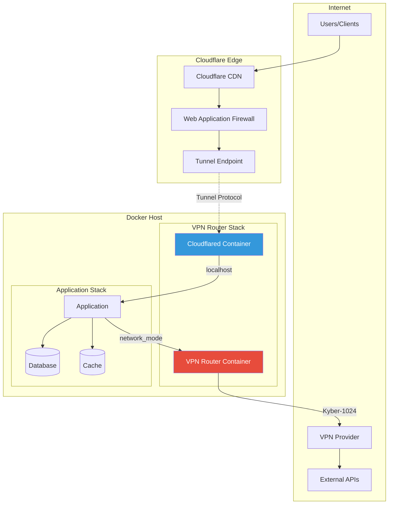
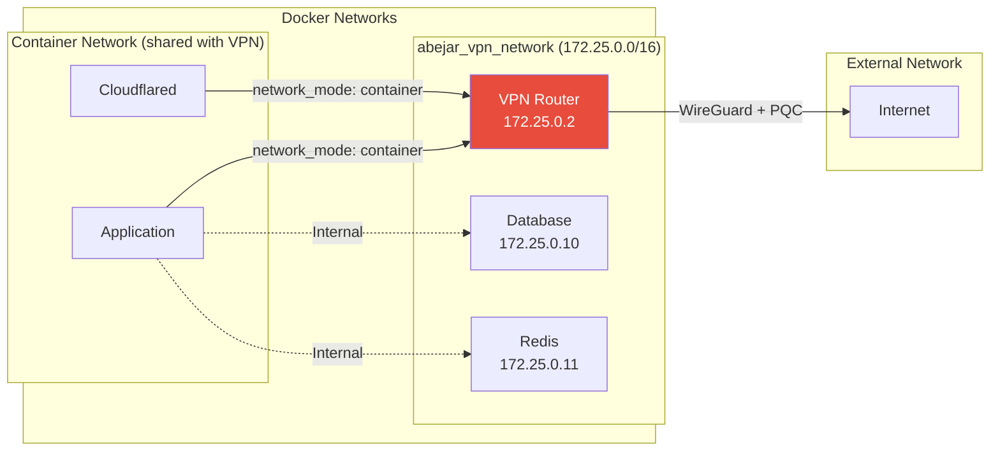
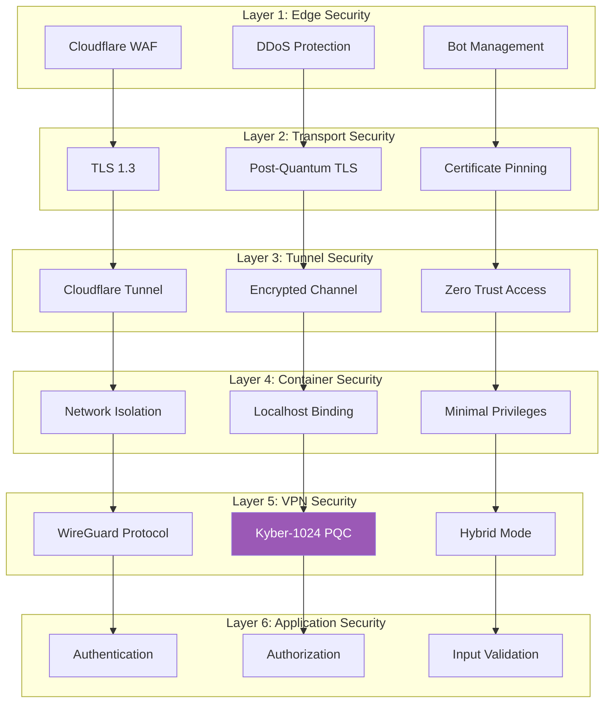
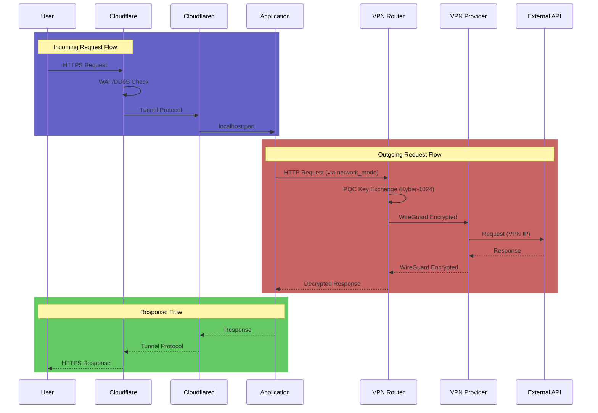
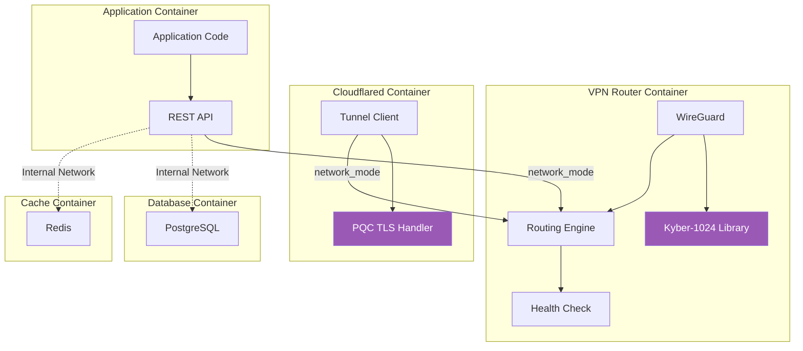

# System Architecture

## Overview

The Abejar PQC VPN Router implements a multi-layered security architecture that combines post-quantum cryptography with modern container orchestration.

## High-Level Architecture

## Network Architecture

## Security Layers

## Data Flow

## Component Diagram

---

For more details, contact: grant@abejar.net

Copyright 2024 Abejar. All rights reserved.
