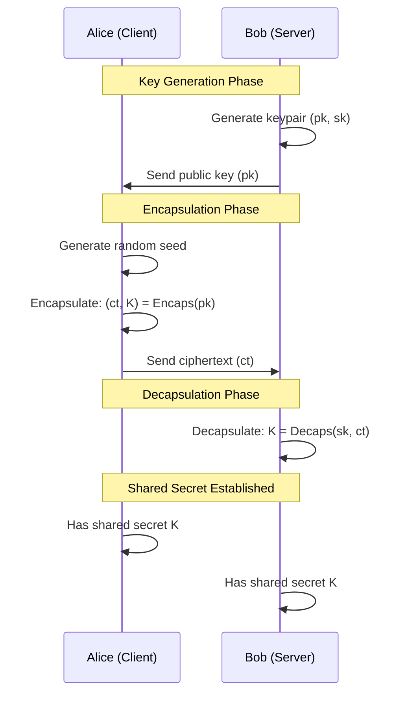
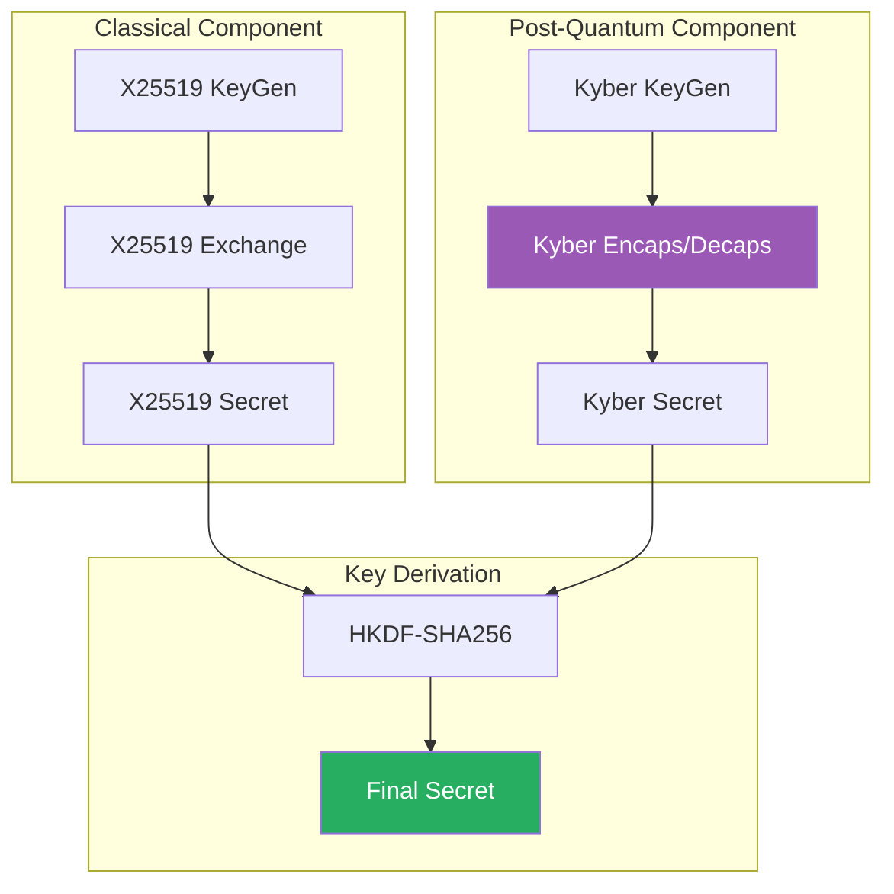

# Post-Quantum Cryptography Technical Details

## Kyber-1024 Algorithm

### Overview

Kyber is a key encapsulation mechanism (KEM) based on the Module Learning With Errors (MLWE) problem. It was selected by NIST as the standard for post-quantum key exchange.

### Key Exchange Flow



### Hybrid Mode (X25519 + Kyber)



### Security Parameters

| Parameter | Value | Security |
|-----------|-------|----------|
| n | 256 | Polynomial dimension |
| k | 4 | Module rank |
| q | 3329 | Modulus |
| eta1 | 2 | Noise parameter |
| eta2 | 2 | Noise parameter |
| du | 11 | Compression parameter |
| dv | 5 | Compression parameter |

### Performance Metrics

```mermaid
xychart-beta
    title "Kyber-1024 Performance (microseconds)"
    x-axis [KeyGen, Encaps, Decaps]
    y-axis "Time (μs)" 0 --> 100
    bar [45, 55, 50]
```



## Implementation Details

### Key Derivation Function

```
Final_Key = HKDF-SHA256(
    IKM = X25519_Secret || Kyber_Secret,
    Salt = Connection_ID || Timestamp,
    Info = "abejar-pqc-vpn-v1",
    Length = 32 bytes
)
```

### Cipher Suite

```
ABEJAR_PQC_KYBER1024_X25519_CHACHA20_POLY1305
```

Components:
- Key Exchange: Kyber-1024 + X25519 (hybrid)
- Symmetric Encryption: ChaCha20
- Authentication: Poly1305
- Hash: BLAKE2s (for WireGuard)

---

For full implementation details, contact: grant@abejar.net

Copyright 2024 Abejar. All rights reserved.
