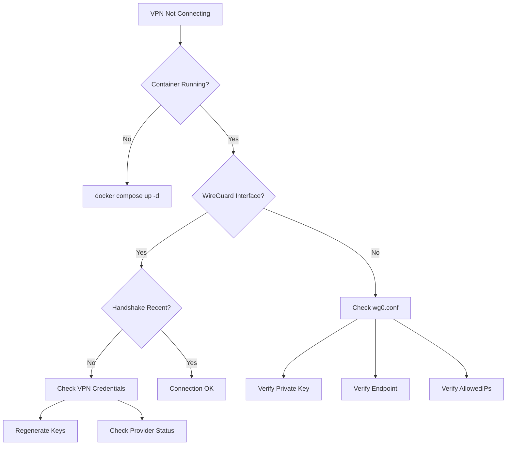
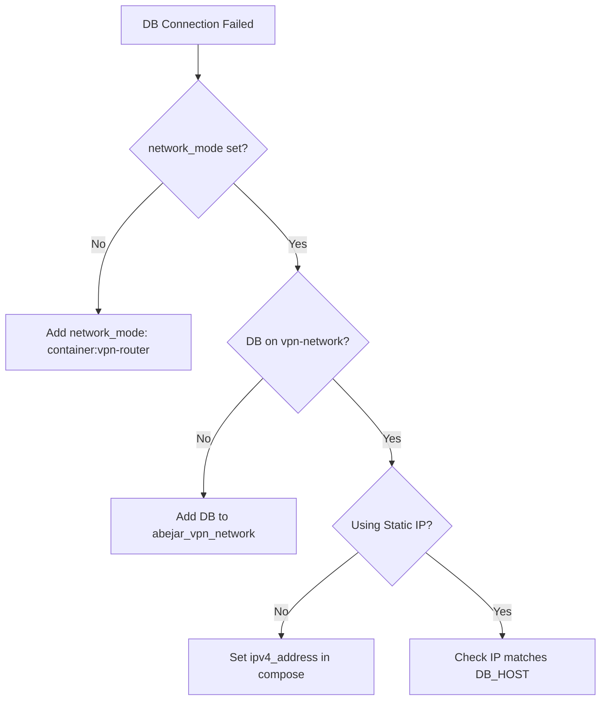

# Troubleshooting Guide

## Common Issues

### VPN Not Connecting



### Application Can't Reach Database



## Diagnostic Commands

```bash
# Check VPN status
./scripts/vpn-status.sh

# Test connection
./scripts/test-connection.sh

# View logs
docker logs vpn-router --tail 100
docker logs cloudflare-tunnel --tail 100

# Check WireGuard
docker exec vpn-router wg show

# Check external IP
docker exec vpn-router curl https://ipinfo.io/ip

# Check network
docker network inspect abejar_vpn_network
```

---

For support, contact: grant@abejar.net

Copyright 2024 Abejar. All rights reserved.
